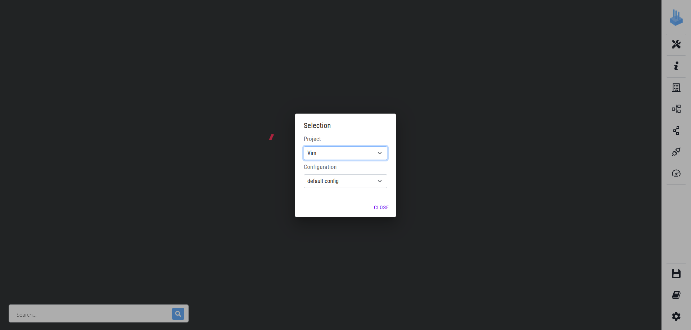
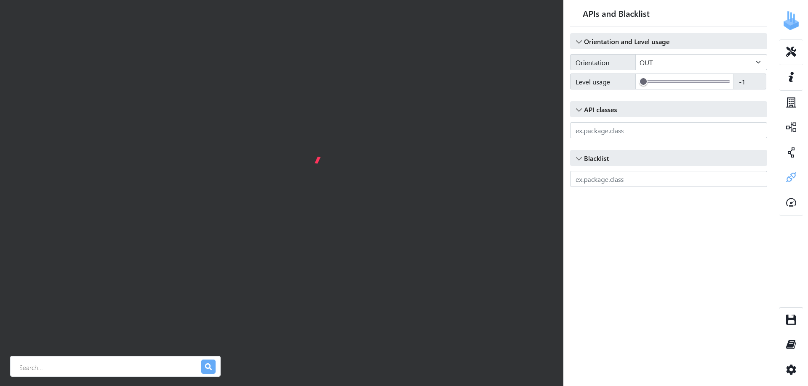
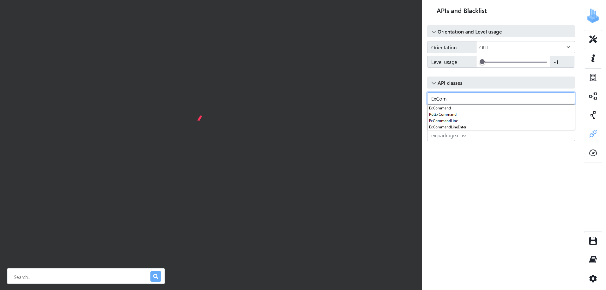
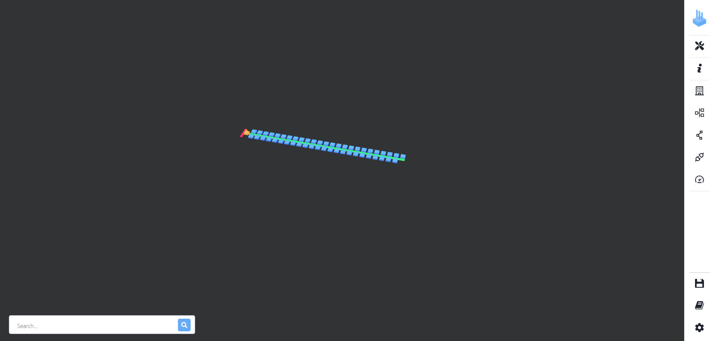

# The VariCity Ecosystem: City Visualization of Object-Oriented Variability in Java and TypeScript
## Artifact Track submission

### Philippe Collet – Johann Mortara –  Yann Brault - Anne-Marie Dery-Pinna

This artifact submission goes with the paper "The VariCity Ecosystem: City Visualization of Object-Oriented Variability in Java and TypeScript" submitted to the SCP special issue on "Tools and Software at the Systems and Software Product Line Conference (SPLC 2022 and 2023)"

## Artifact description

The artifact consists of two archives:

### Current archive

**Accessible at DOI: [https://zenodo.org/records/10709656](https://zenodo.org/records/10709656)**


The current archive is organized as follows:
```
.
├── images/
├── INSTALL.md
├── PROJECTS.md
├── LICENSE.md
├── README.md
├── REQUIREMENTS.md
├── varicity-ts.zip
```

- `INSTALL.md`: VariCity-TS and Symfinder-TS installation instructions
- `PROJECTS.md`: Exhaustive list of analyzed projects and metrics
- `LICENSE.md`: license file
- `README.md`: documentation to reproduce the results of the paper and to reuse VariCity-TS on other projects
- `REQUIREMENTS.md`: technical requirements to use VariCity-TS


### VariCity-TS archive

This archive contains:

- The source code of VariCity-TS.
VariCity-TS relies on data from Symfinder-TS, whose source code is also present in the artifact archive.
- The source code of Symfinder-TS.
- The `dockervolume.zip` archive present at the root of the VariCity-TS archive contains data used to generate visualizations for 7 subject systems studied:
  - pre-generated outputs from the symfinder analyses
  - pre-configured visualizations


## Reproducing the results

### A. Preparing your host system

Set up your host system according to the guidelines given in the `REQUIREMENTS.md` file.

**Note:** Your Docker daemon must be running in order to use VariCity-TS.  

### B. Getting the sources

1. Unzip the archive. You should obtain the following hierarchy (only the files useful for the reproduction are shown):
```
varicity-TS/
├── build_symfinder_ts.sh
├── build_varicity_ts.sh
├── js/ #Symfinder-TS source code
├── dockervolume.zip
├── run_symfinder_ts.sh
└── run-compose.sh
```
In the remainder of this guide, we will refer to `varicity-ts` as the root of the project.
For example, `/dockervolume` represents the `varicity-ts/dockervolume` directory.

### C. Creating the cities with VariCity-TS using the pre-generated visualizations files

The files generated by Symfinder-TS used by VariCity-TS to create the cities for the projects studied, for example, NestJS presented in the paper are available in the `dockervolume.zip` archive.

1. Unzip the `dockervolume.zip` archive to obtain the following hierarchy (only the files useful for the reproduction are shown):
```
dockervolume/
├── configs/
|   ├── azuredatastudio/
|   │   ├── config-azuredatastudio-3.yaml
|   │   ├── config-azuredatastudio-4.yaml
|   │   └── config-azuredatastudio-5.yaml
|   ├── vscode/
|   │   └── config-vscode-6.yaml
|   ├── grafana/
|   │   └── config-grafana-6.yaml
|   ├── angular/
|   │   └──  config-angular-1.yaml 
|   └── nest/
|       ├── config-nest-2.yaml
|       └── config-nest-10.yaml
├── data/
│   └── symfinder_files/
│       ├── azuredatastudio.json
│       ├── vscode.json
│       ├── grafana.json
│       ├── angular.json
│       ├── echarts.json
│       ├── nest.json
│       ├── Vim.json
│       ├── parsed
│       │   ├── azuredatastudio.json
│       │   ├── vscode.json
│       │   ├── grafana.json
│       │   ├── angular.json
│       │   ├── echarts.json
│       │   ├── nest.json
│       │   └── Vim.json
└── varicitydb.json
```
The `dockervolume/configs` directory contains the configurations for the views for each project.
The `dockervolume/data` directory contains the symfinder outputs for each project.

2. Run VariCity-TS by running


- On GNU/Linux

    ```
    ./run-compose.sh
    ```
  
For more information on the execution of VariCity-TS, see `INSTALL.md`.

3. Open your web browser and go to [http://localhost:8000](http://localhost:8000)
4. Click on the `Project` dropdown menu. A list of the available projects appears.

5. By clicking on the desired project's name here Nest, a pre-configured view appears in the background. You can choose the view you want by clicking on the second dropdown menu.

6. The `dockervolume/configs` directory contains a directory for each project, containing several pre-configured views. The Nest configuration matching the view presented in the paper as `Figure 4b` is labeled under `Varicity view - Figure 2`.
7. By clicking on the view `Varicity view - Figure 2`, the city is loaded.

-The visualization above shows Nest with usage orientation set to OUT and usage level set to 2.

>Please note that the visualization may not be centered when appearing. The rendering time of the visualization increases with the number of buildings to display.
>To limit the loading time when switching between projects, we advise reducing the value of the usage level to limit the number of buildings to render before switching.

### D. Generating the visualization files with Symfinder-TS

The Varicity-TS artifact contains in the `/Dockervolume/data` directory the configurations for the systems studied.
- `azuredatastudio.json` → [Azure Data Studio](https://github.com/microsoft/azuredatastudio)
- `vscode.json` → [VSCode](https://github.com/microsoft/vscode)
- `grafana.json` → [Grafana](https://github.com/grafana/grafana)
- `angular.json` → [Angular](https://github.com/angular/angular)
- `echarts.json` → [Echarts](https://github.com/apache/echarts)
- `nest.json` → [Nest](https://github.com/nestjs/nest)
- `Vim.json` → [Vim](https://github.com/VSCodeVim/Vim)

To generate the visualization files for a project, go to the root of the project and run Symfinder-TS as detailed in the "Running a Symfinder-TS analysis" section of the `INSTALL.md` file.

*Notes:* Some analyses, such as Azure Data Studio, VS Code, Grafana or Angular can take multiple hours.
We advise, for a quick evaluation of the toolchain's capabilities, to analyze smaller projects (e.g. Echarts, Nest, or Vim).

## Reusing VariCity-TS and Symfinder-TS on other projects

To analyze a project, you will need to:
- Have a web URL of your GitHub repository. Be careful to use the web page link and **NOT** the HTTPS clone link.

Hereafter we will detail the steps to configure a view on one of these systems, [Vim](https://github.com/VSCodeVim/Vim).

Let's execute Symfinder-TS on Vim.

- In one terminal

```
./run-compose.sh
```

- In another terminal
```
./run_symfinder_ts.sh https://github.com/VSCodeVim/Vim -runner docker -http http://varicity-backend:3000/projects 
```

After the execution of the symfinder analysis, go to [http://localhost:8000](http://localhost:8000) and select the `Vim` project.



A unique view configuration is available, called `default config`, showing an empty visualization.

Close the popup. On the sidebar, click on the `APIs and Blacklist` button.



In the `API classes` field, start typing `ExCommand`, and select `ExCommand`.



Press Enter, and a visualization should appear.



This visualization is the standard VariCity one.

By clicking on the city you obtain information.


This [class](https://github.com/VSCodeVim/Vim/blob/master/src/vimscript/exCommand.ts) is the abstract class for all Vim commands hence the high numbers of subclasses (blue buildings)


## Detailed README

A more exhaustive documentation on
- the capabilities of the VariCity-TS visualization
- the Symfinder-TS analysis
- the technical organization of the toolchain
is available in the `README.md` file at the root of the varicity-TS archive, which itself points to other documentation.
