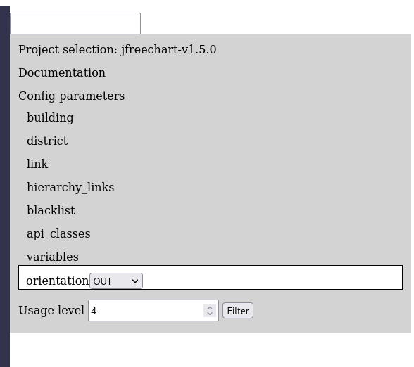
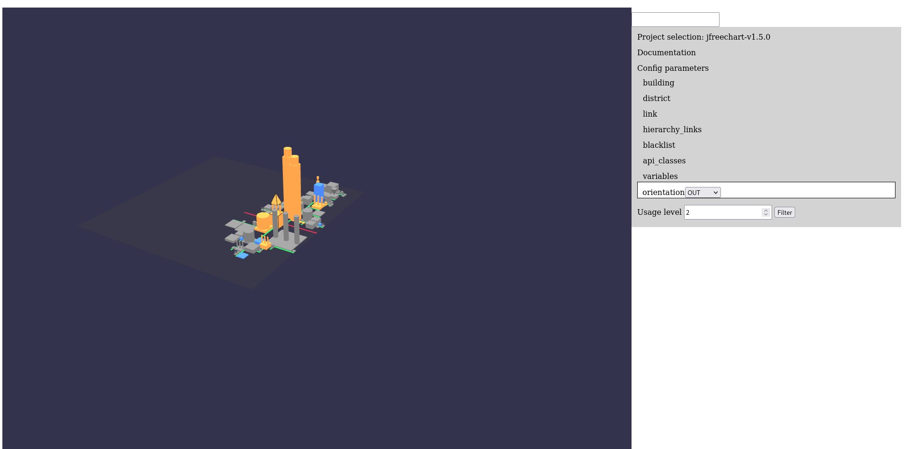

# Visualization of Object-Oriented Variability Implementations as Cities
## Artifact Track submission

### Johann Mortara – Philippe Collet – Anne-Marie Dery-Pinna

This artifact submission goes with the paper "Visualization of Object-Oriented Variability Implementations as Cities" accepted in the Technical Track of VISSOFT 2021.

## Artifact description

The artifact consists in the source code of VariCity, the city visualization presented in the paper.
VariCity relies on data from symfinder, whose source code is also present in the artifact archive.
Pre-generated visualizations for all 10 subject systems presented in the Table II of the paper and in the scenarios are available in the `pre_generated_visualizations.zip` archive present at the root of the artifact archive.

## Availability

The artifact is available on Zenodo and accessible through the following DOI: https://doi.org/10.5281/zenodo.5034199


## Reproducing the results presented in the paper

### A. Getting the sources

1. Download the archive available at https://doi.org/10.5281/zenodo.5034199
2. Unzip the archive. You should obtain the following hierarchy (only the files useful for the reproduction are shown):
```
varicity_reproduction-package
├── build.bat
├── build.sh
├── experiments
│   ├── experiments.yaml
|── ...
├── pre_generated_visualizations.zip
├── rerun.bat
├── rerun.sh
├── run.bat
├── run.sh
|── ...
├── varicity
   ├── build.bat
   ├── build.sh
   ├── config
   │   └── config.yaml
   ├── varicity.bat
   ├── varicity.sh
```
In the remaining of this guide, we will refer to `varicity_reproduction-package` as the root of the project.
For example, `/varicity` represents the `varicity_reproduction-package/varicity` directory.

### B. Creating the cities with VariCity using the pre-generated visualizations files

The files generated by symfinder and used by VariCity to create the cities for the 10 projects presented in the paper are available in the `pre_generated_visualizations.zip` archive.

1. Unzip the `pre_generated_visualizations.zip` archive to obtain the following hierachy (only the files useful for the reproduction are shown):
```
varicity_reproduction-package
|── ...
├── generated_visualizations
│   ├── argoUML-bcae373-composition.html
│   ├── argoUML-bcae373.html
│   ├── argoUML-bcae373.log
│   ├── awt-jb8u202-b1532-composition.html
│   ├── awt-jb8u202-b1532.html
│   ├── awt-jb8u202-b1532.log
│   ├── cucumber-v6.8.0-composition.html
│   ├── cucumber-v6.8.0.html
│   ├── cucumber-v6.8.0.log
│   ├── cxf-cxf-3.2.7-composition.html
│   ├── cxf-cxf-3.2.7.html
│   ├── cxf-cxf-3.2.7.log
│   ├── data
│   │   ├── argoUML-bcae373.json
│   │   ├── argoUML-bcae373-stats.json
│   │   ├── awt-jb8u202-b1532.json
│   │   ├── awt-jb8u202-b1532-stats.json
│   │   ├── cucumber-v6.8.0.json
│   │   ├── cucumber-v6.8.0-stats.json
│   │   ├── cxf-cxf-3.2.7.json
│   │   ├── cxf-cxf-3.2.7-stats.json
│   │   ├── jfreechart-v1.5.0.json
│   │   ├── jfreechart-v1.5.0-stats.json
│   │   ├── junit-r4.12.json
│   │   ├── junit-r4.12-stats.json
│   │   ├── logbook-2.2.1.json
│   │   ├── logbook-2.2.1-stats.json
│   │   ├── maven-maven-3.6.0.json
│   │   ├── maven-maven-3.6.0-stats.json
│   │   ├── netbeans-12.2.json
│   │   ├── netbeans-12.2-stats.json
│   │   ├── riptide-2.11.0.json
│   │   └── riptide-2.11.0-stats.json
│   ├── index.html
│   ├── jfreechart-v1.5.0-composition.html
│   ├── jfreechart-v1.5.0.html
│   ├── jfreechart-v1.5.0.log
│   ├── junit-r4.12-composition.html
│   ├── junit-r4.12.html
│   ├── junit-r4.12.log
│   ├── logbook-2.2.1-composition.html
│   ├── logbook-2.2.1.html
│   ├── logbook-2.2.1.log
│   ├── maven-maven-3.6.0-composition.html
│   ├── maven-maven-3.6.0.html
│   ├── maven-maven-3.6.0.log
│   ├── netbeans-12.1-composition.html
│   ├── netbeans-12.1.html
│   ├── netbeans-12.1.log
│   ├── riptide-2.11.0-composition.html
│   ├── riptide-2.11.0.html
│   ├── riptide-2.11.0.log
│   ├── scripts
│   ├── style.css
│   ├── symfinder-icon.png
│   └── symfinder-legend.svg
|── ...
├── varicity
   ├── build.bat
   ├── build.sh
   ├── config
   │   └── config.yaml
   ├── varicity.bat
   ├── varicity.sh

```
2. Move to `/varicity`
3. Start VariCity (see the section "Running VariCity" of the INSTALL.md file)
4. Open your web browser and go to `http://localhost:9090`
5. On the right panel, click on `Project selection`. A list of the available projects appear.

6. By clicking on the desired project's name, the visualization appears on the left, here JFreeChart.

7. The entrypoint classes for all projects are pre-configured with the names present in Table II (in JFreeChart's case, `org.jfree.chart.JFreeChart` and `org.jfree.chart.plot.Plot`).
However, the usage orientation and usage level need to be set manually.
These two settings are available on the right panel.
The usage level setting is present at the top level of the panel, whereas the usage orientation is in the `Config parameters` menu.


Changing the value of one of these parameters regenerates the visualization.

The visualization above shows JFreeChart with usage orientation set to OUT and usage level set to 2, shown in Fig. 6a of the paper.

The pre-configuration is done by modifying the `/varicity/config/config.yaml` file.
More details about the different configuration options are present in the `README.md` file present in the artifact's root directory.

### C. Generating the visualizations files with symfinder

symfinder is pre-configured to be executed on the 10 systems presented in the paper.
More details about the analysed projects and their definition are given in the "Using symfinder on your project" section in the README present in the artifact's root directory.

To generate the visualizations files, go to the root of the project and run symfinder as detailed in the "Running symfinder" section of the INSTALL.md file.

*Note:* Analysing the 10 projects with symfinder can be time consuming, especially for CXF and NetBeans which can require multiple hours of computation depending on your host system.
To obtain minimum but viable results for reproduction in a reasonable amount of time, we thus advise to analyse only small projects, like JFreeChart for example.


## Reusing VariCity and symfinder on other projects

Instructions to adapt symfinder and VariCity for your project are detailed in the sections "Using symfinder on your project" and "Configure VariCity for your project" in the artifact's README.md file.
