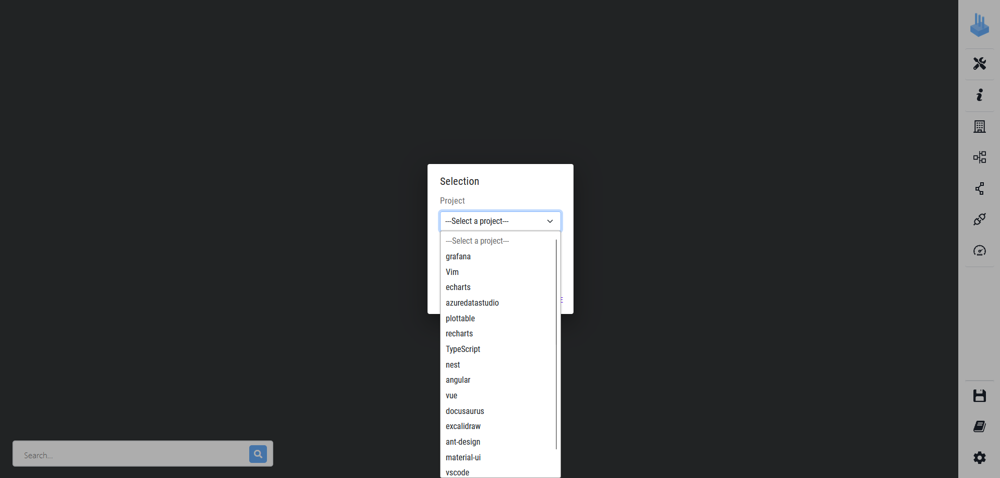
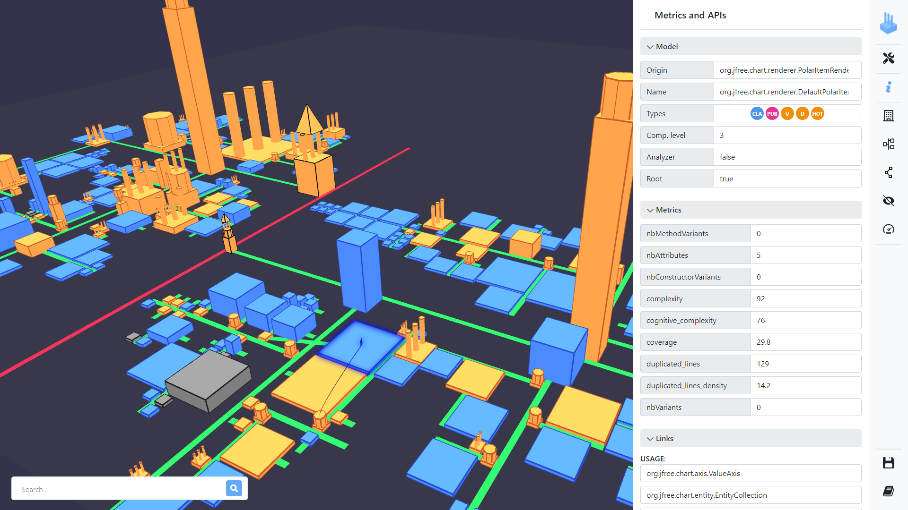
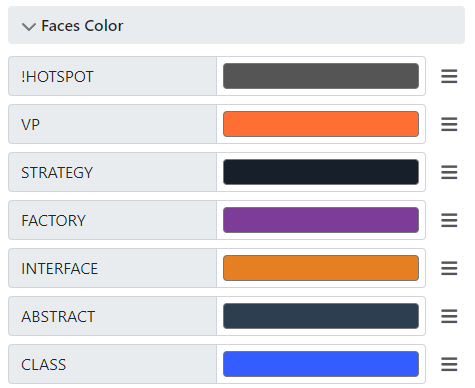

# VariCity

VariCity is a 3D visualization relying on the city metaphor to display zones of high density of variability implementations in a single system.
The city is built by creating building, corresponding to classes, and streets, grouping every class linked to the street's starting building.

In order to build the city, VariCity parses the JSON files produced by symfinder and symfinder to produces a graph composed by classes and their links. The starting points of this graph are API classes, defined by the user.
API classes are the first buildings placed on the "root" street, and classes linked to them are placed in their corresponding streets.
Links used to produce this hierarchy can be configured, depending on their type (inheritance or usage), and orientation (see the [Configuration](#configuration) section).

In order to use VariCity to visualize your project, you need to first analyse it using the symfinder toolchain. [Go to symfinder's documentation](./../symfinder/symfinder/README.md)

## Technical Requirements

- Docker
    - Instructions to install Docker are available [here](https://docs.docker.com/get-docker/).
- Docker Compose
    - Instructions to install Docker Compose are available [here](https://docs.docker.com/compose/install/#install-compose).
- Docker with WSL2 on Windows
    - Instruction to install Docker are available [here](https://learn.microsoft.com/en-us/windows/wsl/tutorials/wsl-containers)

**Note:** By default, on a GNU/Linux host, Docker commands must be run using `sudo`. Two options are available for you in order to run the project:
- Follow [these short steps](https://docs.docker.com/install/linux/linux-postinstall/#manage-docker-as-a-non-root-user) to allow your user to call Docker commands,
- Preface the scripts calls with `sudo`.


## Running VariCity

### Reusing the existing Docker image

All scripts mentioned in this section are not located in the folder containing this readme.  
They are located and executed from the root of the VariCity-TS folder.

The following Docker image hosted on the [Docker Hub](https://hub.docker.com/) allows to use VariCity without needing to build it.
```
deathstar3/varimetrics
deathstar3/varimetrics-backend
```

Run VariCity by running


- On GNU/Linux

    ```
    ./run-compose.sh
    ```

*Note:* As for symfinder, the Docker image is automatically downloaded by Docker with the tag `scp2024` if it is not found on the host system.

### Building VariCity

**This step is only needed if you edited VariCity's source code.**

You can build VariCity Docker images by running

```
./build_varicity_ts.sh
```

Then, change the TAG variable in the `run-compose` script from `scp2024` to `local`:

- On GNU/Linux, edit `run-compose.sh`
```
- export TAG=scp2024
+ export TAG=local
```

## Using VariCity

To access the visualization once VariCity is running, you need to access [http://localhost:8000/](http://localhost:8000/) via a web browser.

### Select a project

**To illustrate, we use here the project [Nest](https://github.com/nestjs/nest) as an example.**

- To select the project you want to visualize, click on the `Project` dropdown menu. A list of the available projects appears.


- By clicking on the desired project's name here Nest, a pre-configured view appears in the background. You can choose the view you want by clicking on the second dropdown menu.

> You will most probably have to wait for a few seconds while the file is getting parsed before the visualization actually appears on your screen.

- By clicking on the view `Varicity view - Figure 2`, the city is loaded.


> The visualization above shows Nest with usage orientation set to OUT and usage level set to 2.

### Exploring your city

Once the visualization is up, you can explore the city by moving the camera with the following controls:

- Left mouse button: Drag to turn the camera
- Right mouse button: Drag to move the camera, horinzontally and vertically
- Scroll up/down: Zoom in/out

_Note that if you zoom in too much, the city might disappear. In this case just scroll back on drag your camera to a better angle to zoom further in._

You can use the search bar at the bottom left of the screen to search for a specific class and focus the camera on its corresponding building in the visualization (with autocompletion).
If you do so, the requested building is highlighted. 


#### Buildings

Buildings represent classes and wear information with how they are displayed:

- Size:
    - Height: by default, the height of a building depends on the number of method variants of the class.
    - Width: by default, the width of a building depends on the number of constructor variants of the class.
- Color: the color of a building depends on the tags of its corresponding class (see the config section)
- Models: Some building may have additional features to their 3D model:
    - Design patterns:
        - Chimneys:  A building with chimneys represents a Factory class  
          
        - Dome: A building with a dome represents a Strategy class  
          
        - Inverted pyramid: A building with an inverted pyramid represents a Template class  
          
        - Sphere: A building with a sphere represents a Decorator class  
          
    - Pyramid and outline: The API classes have a pyramid and an outline added to their representation  
      


#### Links

In VariCity, you can also see relations between your classes, in different ways:

- Streets: A street is created when a VP is parsed, and all its variants are displayed next to the street.
- Aerial links: By default, inheritance links (**EXTENDS** and **IMPLEMENTS**) are displayed as aerial links. The building at the darker side is the source (subclass), and the one at the brighter side is the destination (superclass).  
    
  *On the left, the bright side of the link means that the yellow building is the super class of the blue building on the other hand, at the dark side.*

By clicking on a building, you can display the links leading to or coming from it, as well as detailed info on the side menu (types, attributes, links, etc.) in the "Object details" section.

  
*The highlighted building has all its links displayed*


#### How to understand implemented variability 

This section aims to explain how to understand the city you are exploring. 

The [Nest](https://github.com/nestjs/nest) project is still used as an example to illustrate.
Nest is a modular and extensible framework for back-end development in JavaScript

- If you followed the steps at the section `Select a project`, you have this city view. 


First things that stand out are high towers and a long street with a lot of blue buildings.


##### The left tower


- It is very high, and yellow. why ? 

> In varicity the basic colors for buildings are blue and yellow. The former is assigned to class building and the later to class building that are considered variation points (vp-s)
> The size of a building can vary either on vertical axis, or horizontal axis. By default the high is determined by the number of method variants and the width the number of constructor variants. So in both cases the higher the number, the bigger the building is.

_So the left tower represents a class that is considered as variation point and it has a lot of method variants._

- By clicking on the building, the informative metrics side panel appears


> You can see a lot of badges i, the "Types" section among which the "vp" badge and the "mlvp" badge. MLVP stands for "Method Level Variation Point" which means that the class as at least one method that is overloaded. This coincides well with the high number of method variants.
> Second thing that catches the eye is in fact the high number of method variants in the metrics. 

The class is in fact a Logger, that has a lot of method overloading. This is explained by the fact that a logger has different levels of logging (info, log, debug,...) and depending on the context could require to send several information or of different types, hence the heavy overloading. 

##### The long street


- Entrypoint is yellow and of normal size, but it has a lot of linked buildings. 

- By hovering the entrypoint with your mouse, you can see a lot of link going from the entrypoint to each building. 

> If you haven't modify links parameters these links are supposed to be aerial and blue, and they visualize EXTENDS relationship, meaning the entrypoint class has a lot of inheritance, which is the source of the variability here. 

- By clicking on the node, the side panel appears and you can see the node is the basic Exception class. So each building is a type of exception that specialize the context and the behavior of the basic one, this explains the high number of classes extending the entrypoint (hence a high number of buildings). 

##### On the right of the Exception class entrypoint
 

 - This entrypoint has an additional shape.

 - By clicking on the `Documentation` menu in the side panel, you have information on the differnet building shapes. 

 
 
 
- The building is then a Strategy pattern, which brings the variability here. Once again, you can click on the building to see its information. 


The class is the ClientProxy class. Nest can be used to build monolithic applications, but the main use if for microservices architecutres. There are two main components to build these architectures in Nest which are the clients and servers. The ClientProxy is the strategy responsible for the different clients. There are several clients to handle the variability in the different transport layer used in the microservices. 

This class goes then as a pair with the strategy building right behind it that is the Server factory. 


Both of these classes are used by their respective factories that are used to create the required components. 


These two buildings introduces variability has they are Factory patterns.


### Configuration

In the side menus, you can change various configuration variables (in order from top to bottom):
- Building:
  - padding: will change the space between each building (default is 0.2)
  - colors:
    - faces: Contains the colors list in which the buildings should be displayed according to their tags. Every colors list in the configuration is ordered, and if a class has two of the listed tags, the first one in the list will be taken into account. Putting a ```!```before a tag name will set the color for each class that does not have the tag.
    
    - edges: Colors list for the outlines of the buildings (by default, there is only a black outline for the API classes).
- District:
    - padding: Space between every district (default is 0)
    - faces color: Colors list for the types of package (tag PACKAGE is for the root street, tag VP is for the other streets).
- Link:
    - colors: Colors list for the links.
    - display:
      - air_traffic: List of tags corresponding to the links that should be displayed as aerial links.
      - underground_road: List of tags corresponding to the links that should be displayed as underground links.
      - hierarchy_links: List of link types used to compose the graph of the city.
- APIs and Blacklist:
  - Usage level: Change the level of usage used to display the city (default is 4).
  - Orientation: Can be IN, OUT. Used to change the orientation of the links used to establish the usage level of each element.
  - api_classes: For each project, list of names of the entry point classes used as starting points to build the city.
  - blacklist: Each class or package in this list will be excluded from visualization.
- Metrics:
  - variables: Names of the variables used to determine the height and the width of the buildings (do not change unless you know the variable names in the source code).

#### Save a configuration 

Once a city is displayed, you can save it as a new configuration for later use.

- Click on save in the side menu 

- Click on save configuration

- Choose a name for your configuration

_Note that the same menu can be used to update your existing configuration. Either for updating camera position, or in case of changes like addition/deletion of entrypoints, colors etc._